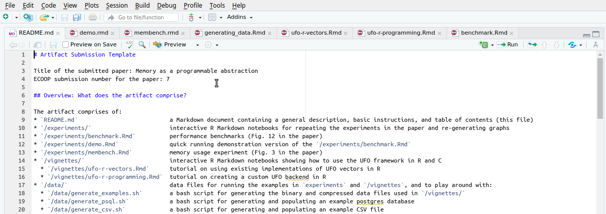
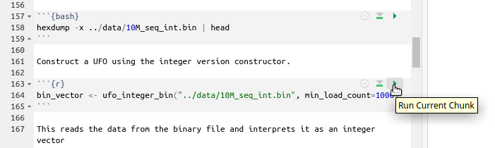
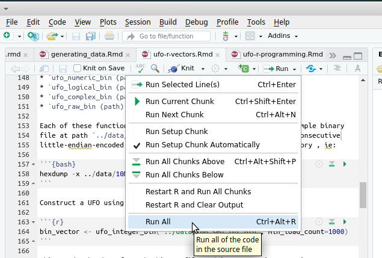
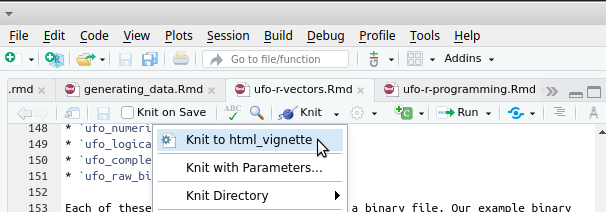

# Artifact Submission Template

Title of the submitted paper: Memory as a programmable abstraction
ECOOP submission number for the paper: 7

## Overview: What does the artifact comprise?

The artifact comprises of:
* `README.md`                           a Markdown document containing a general description, basic instructions, and table of contents (this file)
* `/experiments/`                       interactive R Markdown notebooks for repeating the experiments in the paper and re-generating graphs
* `/experiments/benchmark.Rmd`          performance benchmarks (Fig. 12 in the paper)
* `/experiments/demo.Rmd`               quick running demonstration version of the `/experiments/benchmark.Rmd`
* `/experiments/membench.Rmd`           memory usage experiment (Fig. 3 in the paper)
* `/vignettes/`                         interactive R Markdown notebooks showing how to use the UFO framework in R and C
  * `/vignettes/ufo-r-vectors.Rmd`      tutorial on using existing implementations of UFO vectors in R
  * `/vignettes/ufo-r-programming.Rmd`  tutorial on creating a custom UFO backend in R
* `/data/`                              data files for running the examples in `experiments` and `/vignettes`, and to play around with:
  * `/data/generate_examples.sh`        a bash script for generating the binary and compressed data files used in `/vignettes/`
  * `/data/generate_psql.sh`            a bash script for generating and populating an example postgres database
  * `/data/generate_csv.sh`             a bash script for generating and populating an example CSV file
* `/projects/`                          source code of the frameworks described in the paper (each project contains compilation instructions in a `README.md` file)
  * `/projects/ufo-core`                source code of the UFO core framework (Rust project)
  * `/projects/ufo-c`                   source code of UFO C bindings (Rust project generating C headers)
  * `/projects/ufo-r`                   source code of a framework for implementing R vectors as UFOs (C/R package)
  * `/projects/ufo-r-vectors`           source code of a library of UFO implementations of R vectors (C/R project)
  * `/projects/altrep`                  source code a library of ALTREP reimplmenetations of some UFOs (C/R project), used in `/experiments/benchmark.Rmd`
  * `/projects/membench`                source code of a memory bechmark for UFOs, used in `/experiments/membench.Rmd`
  * `/projects/viewports`               source code of an auxiliary R package for subsetting R vectors, a dependency for `/projects/ufo-r-vectors`

The root directory `/` above refers to the artifact root at `/home/submitter/workspace/artifact` (not system root).

The VM containing the artifact runs Xubuntu Linux 21.10 and comes with the following
packages pre-installed:
* postgresql,
* bzip2,
* the R runtime with additional libraries:
  * dplyr,
  * devtools,
  * ggplot2,
  * microbenchmark,
  * scales,
  * readr,
* rstudio.

The artifact generates the following files during the course of its execution:

  * `/data/demo_32M_seq_ints.bin`                        a binary file containing an array of 32M integers whose values start at 0 and increase by one, generated by `/vignettes/demo.Rmd` 
  * `/data/250M_rand_int.bin`                            a binary file containing an array of 250M integers with randomly generated values, generated by `/vignettes/benchmark.Rmd`
  * `/data/{1K,100K,1M,10M}_seq_int.bin`                 binary files containing an array of integers, whose values start at 0 and increase by one, generated by `/vignettes/generate_data.Rmd`
  * `/data/{1K,100K,1M,10M}_rand_int.bin`                a binary file containing an array of integers with randomly generated values, generated by `/vignettes/generate_data.Rmd`
  * `/data/{1K,100K,1M,10M}_{seq,rand}_int.bin.bz2`      BZip2-compressed versions of the above (`900K` block size), generated by `/vignettes/generate_data.Rmd`
  * `/data/example.csv`                                  an example CSV file containing 4 columns and 2000 rows, generated by `/vignettes/generate_data.Rmd`
  * `/figs/250M_{rand_bin,seq}_{create,loop,sum}.pdf`    PDFs constituent to Fig. 12 in the paper, generated by `/experiments/benchmark.Rmd`
  * `/figs/membench.pdf`                                 PDFs of Fig. 3 in the paper, generated by `/experiments/membench.Rmd`

## Badges

We claim the following badges for the artifact:
* functional
* reusable
* available

## For authors claiming a functional or reusable badge: What are claims about the artifact’s functionality to be evaluated by the committee?

Functional evaluation of claims:

* The paper claims that programable memory abstractions have performance
  comparable to ALTREP and standard R vectors and outperform ALTREP's dynamic
  dispatch, when accessing individual vector elements. This is shown in Fig. 12.

  We provide the complete recreation of the benchmarks in
  `/experiments/benchmark.Rmd` which re-execute the experiment and re-generate
  graphs used in the paper. The notebook contains full instructions about
  executing the benchmarks. 
  
  The experiment uses `/data/250M_rand_int.bin` as input. The experiment
  compares UFOs implemented by `/projects/ufo-core`, `/projects/ufo-c` ,
  `/projects/ufo-r`, and `/projects/ufo-r-vectors`, ALTREP vectors implemented
  in `/projects/altrep`, and standard R vectors.

* In Fig 3. the paper shows that the memory management implemented within UFOs
  keeps memory usage at a level specified by the high water mark, regardless of
  the collective size of live UFO objects. We show that dirty chunks are backed
  onto a file, contributing to increasing memory usage, and that when no chunks
  are dirtied the disk usage remains constant.

  We provide a complete recreation of the experiment in
  `/experiments/membench.Rmd` which re-execute the experiment and re-generate
  graph from the paper. The notebook contains full instructions for executing
  the experiment.

  The experiment uses the code at `/projects/membench`.

* In addition the paper provides a suite of examples and instructions for
  creating new UFO backends to support the framework's usefulness in problem
  solving and as a tool for library implementers. These can be found in
  `/vignettes/ufo-r-vectors.Rmd` and `/vignettes/ufo-r-programming.Rmd` and use
  data in `/data/` as well as the local postgres instance, database `ufos`.

## For authors claiming a reusable badge: What are the authors' claims about the artifact's reusability to be evaluated by the committee?

Reusability scenarios:

* The benchmarks in `/experiements` are parameterized in terms of high and low
  watermarks, specifying how much memory UFOs can use, chunk sizes, and data
  size, allowing to experiment with the performance of various frameworks under
  differing conditions. We also provide scripts to generate additional data
  files and database tables with different sizes and contents.

* The benchmarks in `/experiments/benchmark.Rmd` can be extended by adding
  additional benchmark scenarios (e.g. a random walk, other operators on
  vectors). The benchmarks are executed using the `microbenchmark` package in R
  which makes it easy to modify or add code to execute within the benchmark.

* The benchmarks in `/experiments/benchmark.Rmd` can also be extended by adding
  new UFO and ALTREP backend implementations, or other similar libraries or
  technologies. We provide a guide on creating new UFO backends in
  `/vignettes/ufo-r-programming.Rmd`.

* We provide usage examples for UFO R vectors which can be modified to explore
  their robustness and discover the limitations of the library.

## For authors claiming an available badge

We will publish the artifact on DARTS. In addition, we will plan to make the
source code and scripts for generating data for the artifact on GitHub for
convenience of access.

## Artifact Requirements

The artifact is a virtual machine image in OVF 2.0 format. A virtual machine
platform that supports OVF 2.0 is required (e.g. VirtualBox >=2.2.0, or
[others](https://en.wikipedia.org/wiki/Open_Virtualization_Format)).

The virtual machine is set to use 4GB of RAM and 4 processor cores. We recommend
running it on a system that matches or exceeds these parameters. The virtual
machine image takes up approximately 30 GB of disk space.

Benchmark performance results may be impacted by memory size, and memory and
disk speeds.

The VM has to have `vm.unprivileged_userfaultfd` set to `1`. This is the case by
default, but it will not survive a reboot.

## Getting Started

Our artifact is packaged as a VirtualBox V. Download the VM from:

```
http://fleshthatthinks.com/MaaPA.tar.gz
```

Then, use VirtualBox's *Import Appliance* feature, which adds the VM to the
list of your virtual machines. At this point you can also customize the number
of CPUs and RAM used in the VM settings. The initial configuration is 4GB of RAM
and 4 processor cores. We encourage to increase the number of cores to improve
performance.

Start the artifact. This boots Xubuntu 21.10. The system has the following user
credentials configured:

```
username: submitter
password: somethingEasy

root password: somethingEasy
```

The artifact is self contained. It contains R markdown notebooks that are used
to generate data and run experiments. These notebooks are interactive
documentation with a mixture of text and runnable code snippets, similar to
jupyter notebooks for Python. They are all initially opened when the VM is
started. 



When working with R notebooks, to execute a particular code block you can either
click on the green play icon above the block. 



You can also execute multiple blocks via the *Run* menu.



You can also *knit* an Rmd file. This will execute all of the blocks it contains
and generate an HTML file with the text and results of the execution.



### Contents

The reader is encouraged to explore the three experiments and two tutorials we
provide:

* **Demo** (at `experiments/demo.Rmd`) contains a self-contained variant of the
  benchmarks performed in the paper (Fig. 12). This variant is streamlined and
  tuned to execute quickly (around a minute). It also contains a discussion of
  factors impacting performance. **We recommend starting here.**

* **Membench** (at `experiments/membench.Rmd`) explores memory and disk usage of
  the UFO framework. **It generates Fig. 3 from the paper.**

* **Benchmark** (at `experiments/benchmark.Rmd`) performs the performance
  benchmarks for UFOs, comparing their performance to equivalent ALTREP vectors
  and ordinary in-memory R vectors. **This generates Fig. 12 from the paper.**

* **UFO vectors** (at `vignettes/ufo-r-vectors.Rmd`) provides a tutorial for
  using UFOs in R and a guided tour over existing backends. **We recommend using
  this to get a feel for how UFOs are used.**  Before using this notebook,
  generate example data using `vignettes/generating_data.Rmd`.

* **UFO programming** (at `vignettes/ufo-r-programming.Rmd`) provides a tutorial
  for writing new UFO backend implementations. 